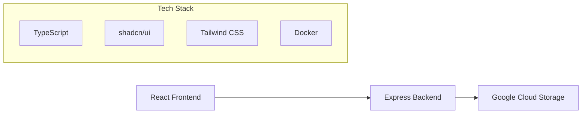
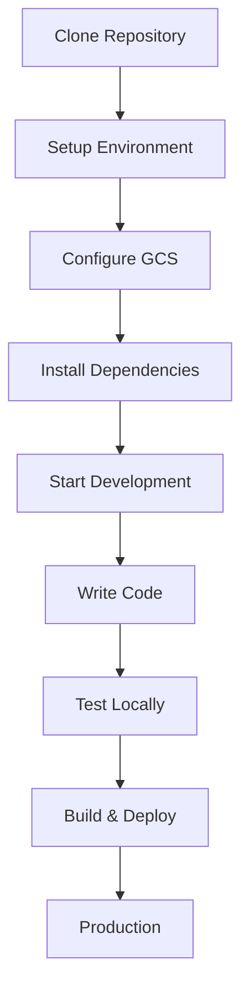

# CloudStorage Documentation

Comprehensive architecture and development documentation for the CloudStorage file management application.

## 🚀 Quick Start

New to the project? Start here:

1. **[Setup Guide](./setup-guide.md)** - Get your development environment running
2. **[Architecture Overview](./architecture.md)** - Understand the system design  
3. **[Development Guide](./development.md)** - Learn development workflows
4. **[API Reference](./api.md)** - Explore the REST API

## 📚 Documentation Index

### Essential Guides
- **[Setup Guide](./setup-guide.md)** - Environment setup and Google Cloud Storage configuration
- **[Development Guide](./development.md)** - Development workflows, patterns, and best practices  
- **[Deployment Guide](./deployment.md)** - Production deployment and Docker configuration

### Technical Reference
- **[Architecture Overview](./architecture.md)** - System architecture, components, and data flow
- **[API Reference](./api.md)** - REST API endpoints with examples
- **[CLAUDE.md](../CLAUDE.md)** - AI assistant guidance for this repository

## 🏗️ Architecture Summary

CloudStorage is a modern web application built with:



### Key Components

| Component | Technology | Purpose |
|-----------|------------|---------|
| **Frontend** | React 18 + TypeScript + Vite | User interface and file management |
| **Backend** | Node.js + Express | REST API and business logic |
| **Storage** | Google Cloud Storage | File persistence and retrieval |
| **UI Framework** | shadcn/ui + Tailwind CSS | Design system and styling |
| **Deployment** | Docker + nginx | Containerized deployment |

### Core Features

- 📁 **File Management**: Upload, download, delete, and preview files
- 🔍 **Search & Filter**: Find files by name, type, and description  
- 📱 **Responsive Design**: Works on desktop, tablet, and mobile
- ☁️ **Cloud Storage**: Scalable storage with Google Cloud Platform
- 🚀 **Modern UX**: Drag & drop, progress tracking, toast notifications

## 🎯 For Different Audiences

### New Developers
1. Read [Setup Guide](./setup-guide.md) to get started
2. Follow [Development Guide](./development.md) for workflows
3. Reference [Architecture Overview](./architecture.md) for system understanding

### DevOps Engineers  
1. Review [Deployment Guide](./deployment.md) for production setup
2. Check [Architecture Overview](./architecture.md) for infrastructure requirements
3. Use [API Reference](./api.md) for monitoring and health checks

### API Consumers
1. Start with [API Reference](./api.md) for endpoints
2. Reference [Setup Guide](./setup-guide.md) for authentication
3. Check [Architecture Overview](./architecture.md) for error handling patterns

### Project Maintainers
1. Review all documentation for completeness
2. Update [CLAUDE.md](../CLAUDE.md) for AI assistant guidance
3. Maintain [Development Guide](./development.md) patterns

## 🛠️ Development Workflow



**Quick Development Commands:**
```bash
# Start development environment
docker-compose up --build

# Or run separately
npm run dev        # Frontend (port 8080)  
cd backend && npm start  # Backend (port 3001)

# Build for production
npm run build      # Frontend
npm run lint       # Check code quality
```

## 🔗 External Resources

### Google Cloud Storage
- [GCS Documentation](https://cloud.google.com/storage/docs)
- [Service Account Setup](https://cloud.google.com/iam/docs/creating-managing-service-account-keys)
- [IAM Permissions](https://cloud.google.com/storage/docs/access-control/iam-permissions)

### Technology Stack
- [React Documentation](https://react.dev/)
- [shadcn/ui Components](https://ui.shadcn.com/)
- [Tailwind CSS](https://tailwindcss.com/)
- [Express.js](https://expressjs.com/)
- [Docker](https://docs.docker.com/)

## 📋 Documentation Standards

### Keeping Documentation Current

**When to Update Documentation:**
- Adding new features or components
- Changing API endpoints or data structures  
- Modifying deployment processes
- Updating dependencies or architecture decisions

**Documentation Review Process:**
1. Update relevant documentation files
2. Test all code examples and commands
3. Verify links and references are working
4. Update version numbers if applicable
5. Consider impact on CLAUDE.md

### Contributing to Documentation

**File Structure:**
```
docs/
├── README.md           # This overview file
├── setup-guide.md      # Environment setup  
├── development.md      # Development workflows
├── architecture.md     # System architecture
├── api.md             # API reference
└── deployment.md      # Production deployment
```

**Writing Guidelines:**
- Use clear, concise language
- Include code examples that work
- Add Mermaid diagrams for complex concepts
- Provide troubleshooting sections
- Test all instructions before publishing

## 🚨 Getting Help

### Common Issues
- Check [Setup Guide](./setup-guide.md#troubleshooting) for environment issues
- Review [Development Guide](./development.md#common-issues-and-solutions) for coding problems
- See [Deployment Guide](./deployment.md#troubleshooting) for production issues

### Support Channels
1. **Documentation**: Start with these docs
2. **Code Comments**: Check inline documentation
3. **Issue Tracking**: Use GitHub Issues for bugs
4. **Architecture Questions**: Review [Architecture Overview](./architecture.md)

---

**Last Updated**: Auto-generated documentation - keep this current with your project development.