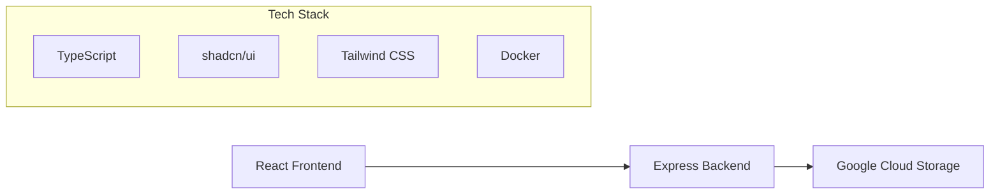
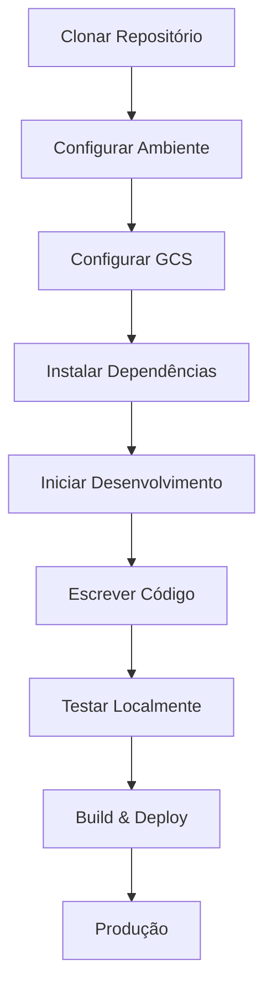

# CloudStorage Documentation

Comprehensive architecture and development documentation for the CloudStorage file management application.

## 🚀 Quick Start

New to the project? Start here:

1. **[Setup Guide](./setup-guide.md)** - Get your development environment running
2. **[Architecture Overview](./architecture.md)** - Understand the system design  
3. **[Development Guide](./development.md)** - Learn development workflows
4. **[API Reference](./api.md)** - Explore the REST API

## 📚 Documentation Index

### Essential Guides
- **[Setup Guide](./setup-guide.md)** - Environment setup and Google Cloud Storage configuration
- **[Development Guide](./development.md)** - Development workflows, patterns, and best practices  
- **[Deployment Guide](./deployment.md)** - Production deployment and Docker configuration

### Technical Reference
- **[Architecture Overview](./architecture.md)** - System architecture, components, and data flow
- **[API Reference](./api.md)** - REST API endpoints with examples
- **[CLAUDE.md](../CLAUDE.md)** - AI assistant guidance for this repository

## 🏗️ Architecture Summary

CloudStorage is a modern web application built with:



### Key Components

| Componente | Tecnologia | Propósito |
|-----------|------------|---------|
| **Frontend** | React 18 + TypeScript + Vite | Interface do usuário e gerenciamento de arquivos |
| **Backend** | Node.js + Express | API REST e lógica de negócio |
| **Storage** | Google Cloud Storage | Persistência e recuperação de arquivos |
| **Framework UI** | shadcn/ui + Tailwind CSS | Sistema de design e estilização |
| **Deploy** | Docker + nginx | Deploy containerizado |

### Core Features

- 📁 **File Management**: Upload, download, delete, and preview files
- 🔍 **Search & Filter**: Find files by name, type, and description  
- 📱 **Responsive Design**: Works on desktop, tablet, and mobile
- ☁️ **Cloud Storage**: Scalable storage with Google Cloud Platform
- 🚀 **Modern UX**: Drag & drop, progress tracking, toast notifications

## 🎯 For Different Audiences

### New Developers
1. Read [Setup Guide](./setup-guide.md) to get started
2. Follow [Development Guide](./development.md) for workflows
3. Reference [Architecture Overview](./architecture.md) for system understanding

### DevOps Engineers  
1. Review [Deployment Guide](./deployment.md) for production setup
2. Check [Architecture Overview](./architecture.md) for infrastructure requirements
3. Use [API Reference](./api.md) for monitoring and health checks

### API Consumers
1. Start with [API Reference](./api.md) for endpoints
2. Reference [Setup Guide](./setup-guide.md) for authentication
3. Check [Architecture Overview](./architecture.md) for error handling patterns

### Project Maintainers
1. Review all documentation for completeness
2. Update [CLAUDE.md](../CLAUDE.md) for AI assistant guidance
3. Maintain [Development Guide](./development.md) patterns

## 🛠️ Fluxo de Desenvolvimento



**Comandos Rápidos de Desenvolvimento:**
```bash
# Iniciar ambiente de desenvolvimento
docker-compose up --build

# Ou executar separadamente
npm run dev        # Frontend (porta 8080)  
cd backend && npm start  # Backend (porta 3001)

# Build para produção
npm run build      # Frontend
npm run lint       # Verificar qualidade do código
```

## 🔗 Recursos Externos

### Google Cloud Storage
- [Documentação GCS](https://cloud.google.com/storage/docs)
- [Configuração de Service Account](https://cloud.google.com/iam/docs/creating-managing-service-account-keys)
- [Permissões IAM](https://cloud.google.com/storage/docs/access-control/iam-permissions)

### Stack de Tecnologia
- [Documentação React](https://react.dev/)
- [Componentes shadcn/ui](https://ui.shadcn.com/)
- [Tailwind CSS](https://tailwindcss.com/)
- [Express.js](https://expressjs.com/)
- [Docker](https://docs.docker.com/)

## 📋 Padrões de Documentação

### Mantendo a Documentação Atualizada

**Quando Atualizar a Documentação:**
- Adicionando novos recursos ou componentes
- Alterando endpoints da API ou estruturas de dados  
- Modificando processos de deploy
- Atualizando dependências ou decisões de arquitetura

**Processo de Revisão da Documentação:**
1. Atualizar arquivos de documentação relevantes
2. Testar todos os exemplos de código e comandos
3. Verificar se links e referências estão funcionando
4. Atualizar números de versão se aplicável
5. Considerar impacto no CLAUDE.md

### Contribuindo para a Documentação

**Estrutura de Arquivos:**
```
docs/
├── README.md           # Este arquivo de visão geral
├── setup-guide.md      # Configuração do ambiente  
├── development.md      # Fluxos de trabalho de desenvolvimento
├── architecture.md     # Arquitetura do sistema
├── api.md             # Referência da API
└── deployment.md      # Deploy em produção
```

**Diretrizes de Escrita:**
- Usar linguagem clara e concisa
- Incluir exemplos de código que funcionem
- Adicionar diagramas Mermaid para conceitos complexos
- Fornecer seções de solução de problemas
- Testar todas as instruções antes de publicar

## 🚨 Obtendo Ajuda

### Problemas Comuns
- Verifique o [Guia de Configuração](./setup-guide.md#troubleshooting) para problemas de ambiente
- Revise o [Guia de Desenvolvimento](./development.md#common-issues-and-solutions) para problemas de codificação
- Veja o [Guia de Deploy](./deployment.md#troubleshooting) para problemas de produção

### Canais de Suporte
1. **Documentação**: Comece com estas docs
2. **Comentários no Código**: Verifique a documentação inline
3. **Rastreamento de Issues**: Use GitHub Issues para bugs
4. **Questões de Arquitetura**: Revise a [Visão Geral da Arquitetura](./architecture.md)

---

**Última Atualização**: Documentação auto-gerada - mantenha atualizada com o desenvolvimento do seu projeto.