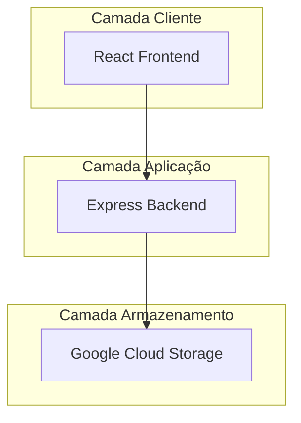
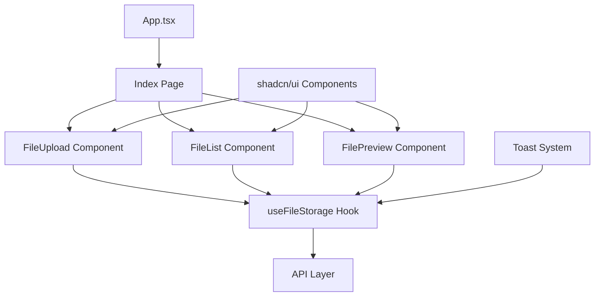
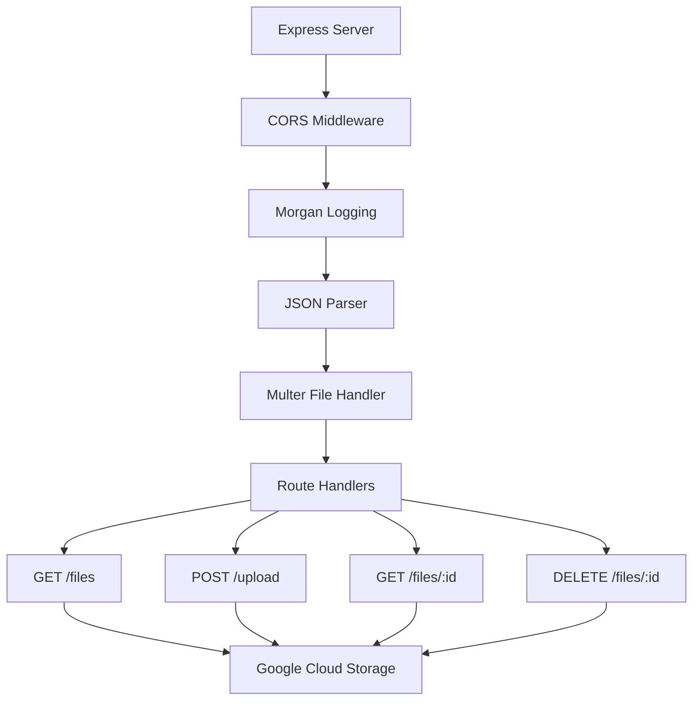
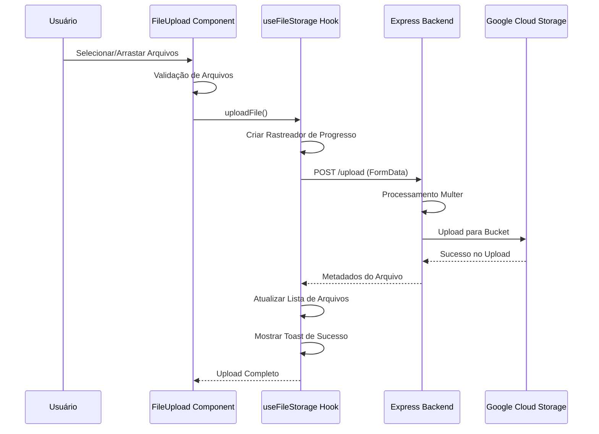
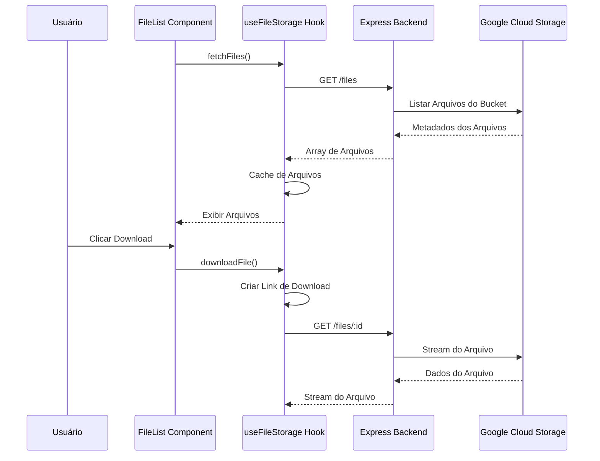

# Visão Geral da Arquitetura

Arquitetura do sistema CloudStorage e relações entre componentes.

## Visão Geral do Sistema

CloudStorage é uma aplicação web moderna para gerenciamento de arquivos com armazenamento em nuvem, construída usando uma arquitetura limpa de 3 camadas:

## Arquitetura de Alto Nível

### Frontend (React SPA)
- **Tecnologia**: React 18 + TypeScript + Vite
- **Framework UI**: shadcn/ui + Tailwind CSS
- **Gerenciamento de Estado**: React Query + Custom Hooks
- **Roteamento**: React Router
- **Ferramenta de Build**: Vite with SWC

### Backend (REST API)
- **Tecnologia**: Node.js + Express
- **Integração Cloud**: Google Cloud Storage SDK
- **Processamento de Arquivos**: Multer (memory storage)
- **Logging**: Morgan
- **Segurança**: CORS habilitado

### Deployment
- **Containerização**: Docker + Docker Compose  
- **Servidor Web**: nginx (proxy frontend)
- **Rede**: Rede bridge interna do Docker

## Arquitetura de Componentes

### Componentes Frontend

#### Componentes Frontend Principais

**1. useFileStorage Hook** (`src/hooks/useFileStorage.ts`)
- **Propósito**: Gerenciamento central de estado para todas as operações de arquivo
- **Responsabilidades**:
  - Listagem e cache de arquivos
  - Upload com rastreamento de progresso
  - Operações de download e exclusão
  - Tratamento de erros e notificações toast
  - Sincronização com backend

**2. FileUpload Component** (`src/components/FileUpload.tsx`)
- **Propósito**: Interface de upload de arquivos com drag & drop
- **Funcionalidades**:
  - Seleção múltipla de arquivos
  - Validação de arquivos (tamanho, tipo)
  - Exibição de progresso de upload
  - Input de descrição do arquivo
  - Feedback visual (animações)

**3. FileList Component** (`src/components/FileList.tsx`)
- **Propósito**: Navegação e gerenciamento de arquivos
- **Funcionalidades**:
  - Modos de visualização em grade/lista
  - Busca e filtragem
  - Categorização de arquivos
  - Operações em lote
  - Ações de preview, download e exclusão

**4. FilePreview Component** (`src/components/FilePreview.tsx`)
- **Propósito**: Modal de preview de arquivos
- **Funcionalidades**:
  - Preview de imagens
  - Exibição de metadados do arquivo
  - Ações de download/exclusão

### Arquitetura Backend

#### Componentes Backend

**1. Express Server** (`backend/index.js`)
- **Propósito**: Servidor REST API
- **Stack de Middleware**:
  - CORS (requisições cross-origin)
  - Morgan (logging de requisições)
  - Express JSON parser
  - Multer (tratamento de upload de arquivos)

**2. Integração Google Cloud Storage**
- **SDK**: `@google-cloud/storage`
- **Autenticação**: Arquivo de chave da conta de serviço
- **Operações**: Listar, upload, download, exclusão
- **Nomenclatura de Arquivos**: Prefixados com UUID para evitar conflitos

## Fluxo de Dados

### Fluxo de Upload de Arquivos

### Fluxo de Listagem/Download de Arquivos

## Padrões Arquiteturais Principais

### 1. Padrão Custom Hook
- **Implementação**: Hook `useFileStorage` encapsula todas as operações de arquivo
- **Benefícios**: Estado centralizado, lógica reutilizável, tratamento consistente de erros
- **Uso**: Compartilhado entre múltiplos componentes

### 2. Composição de Componentes
- **Implementação**: Componentes shadcn/ui compostos em interfaces complexas  
- **Benefícios**: Design consistente, elementos reutilizáveis, código manutenível
- **Exemplo**: FileUpload usa componentes Card, Button, Progress, Toast

### 3. Separação de Responsabilidades
- **Frontend**: Apenas UI/UX e gerenciamento de estado
- **Backend**: Lógica de negócio e integração com nuvem
- **Armazenamento**: Persistência e recuperação de arquivos

### 4. Boundaries de Erro
- **Implementação**: Tratamento consistente de erros via notificações toast
- **Estratégia**: Falha graciosamente, informar usuários, log para debug
- **Cobertura**: Falhas de upload, erros de rede, erros GCS

### 5. Aprimoramento Progressivo  
- **Implementação**: Funcionalidade principal funciona sem JavaScript
- **Funcionalidades**: Design responsivo, componentes acessíveis
- **Fallbacks**: Estados de loading, erro e vazio

## Arquitetura de Segurança

### Segurança Frontend
- **Validação de Input**: Validação de tipo e tamanho de arquivo
- **Prevenção XSS**: Sanitização integrada do React
- **HTTPS**: Obrigatório para deployment em produção

### Segurança Backend  
- **Validação de Arquivos**: Limites de tamanho de arquivo Multer (500MB)
- **CORS**: Configurado para origens permitidas
- **Sanitização de Input**: Proteções integradas do Express
- **Tratamento de Erros**: Nenhum dado sensível em respostas de erro

### Segurança Cloud
- **Autenticação**: Conta de serviço com permissões mínimas
- **Controle de Acesso**: Papéis IAM granulares
- **Segurança de Rede**: Acesso privado ao bucket apenas através da API
- **Criptografia**: GCS trata criptografia em repouso

## Considerações de Escalabilidade

### Limitações da Arquitetura Atual
- **Instância Backend Única**: Sem balanceamento de carga
- **Armazenamento em Memória**: Multer usa memória para processamento de arquivos
- **Sem Cache**: Arquivos buscados do GCS a cada requisição
- **Sem CDN**: Acesso direto ao GCS para downloads

### Oportunidades Futuras de Escala
- **Escalonamento Horizontal**: Múltiplas instâncias backend com balanceador de carga
- **Camada de Cache**: Redis para cache de metadados de arquivos  
- **Integração CDN**: Cloud CDN para entrega de arquivos
- **Banco de Dados**: Adicionar banco de metadados para consultas complexas
- **Autenticação**: Adicionar gerenciamento de usuários e autorização
- **Processamento de Arquivos**: Adicionar redimensionamento de imagens, scanning de vírus

## Decisões Tecnológicas

### Framework Frontend: React + TypeScript
- **Por que**: Ecossistema forte, segurança do TypeScript, reutilização de componentes
- **Alternativas**: Vue.js, Angular, Svelte
- **Trade-offs**: Tamanho do bundle vs. experiência do desenvolvedor

### Biblioteca UI: shadcn/ui + Tailwind
- **Por que**: Componentes modernos, customizáveis, boa acessibilidade
- **Alternativas**: Material-UI, Ant Design, Chakra UI
- **Trade-offs**: Curva de aprendizado vs. flexibilidade

### Backend: Node.js + Express  
- **Por que**: Consistência JavaScript, API REST simples, bom SDK GCS
- **Alternativas**: Python (FastAPI), Go, Java (Spring Boot)
- **Trade-offs**: Performance vs. velocidade de desenvolvimento

### Armazenamento: Google Cloud Storage
- **Por que**: Escalável, confiável, bom SDK, custo-efetivo
- **Alternativas**: AWS S3, Azure Blob Storage, MinIO
- **Trade-offs**: Vendor lock-in vs. funcionalidades