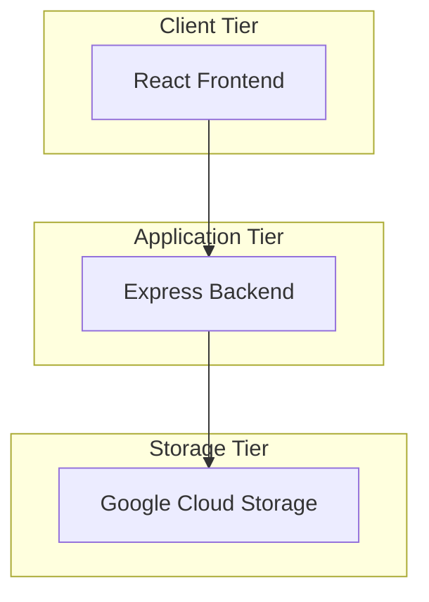
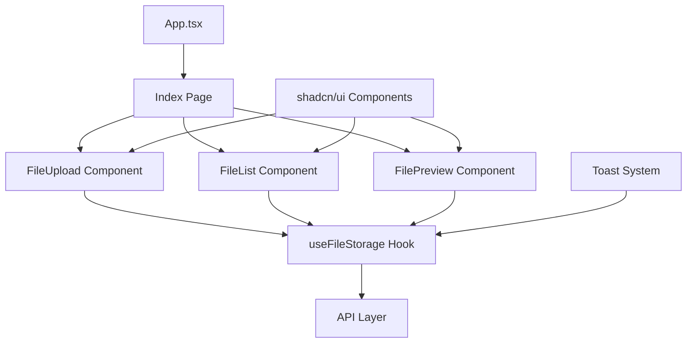
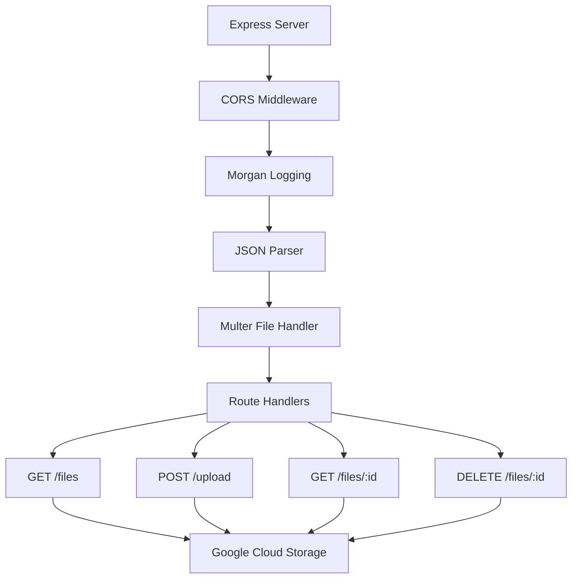
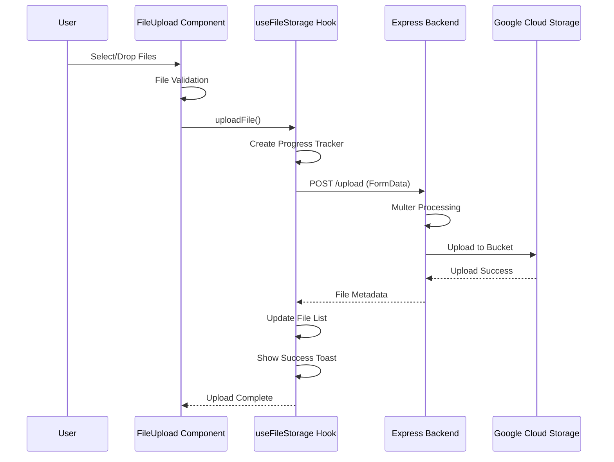
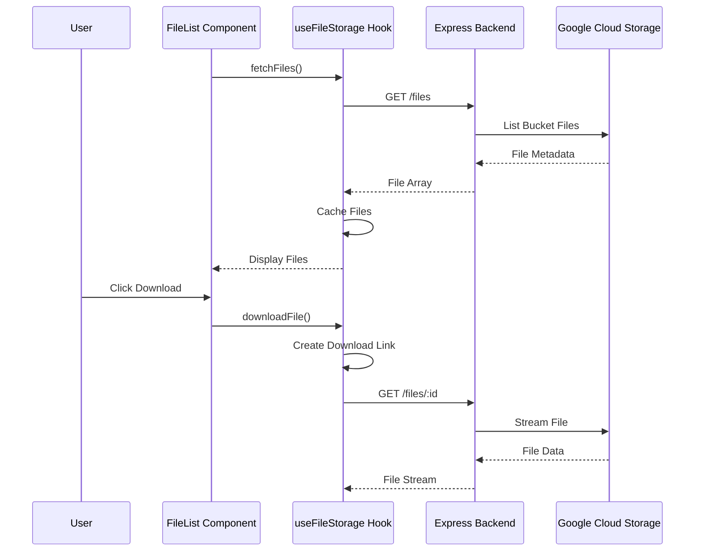

# Architecture Overview

CloudStorage system architecture and component relationships.

## System Overview

CloudStorage is a modern web application for file management with cloud storage, built using a clean 3-tier architecture:

## High-Level Architecture

### Frontend (React SPA)
- **Technology**: React 18 + TypeScript + Vite
- **UI Framework**: shadcn/ui + Tailwind CSS
- **State Management**: React Query + Custom Hooks
- **Routing**: React Router
- **Build Tool**: Vite with SWC

### Backend (REST API)
- **Technology**: Node.js + Express
- **Cloud Integration**: Google Cloud Storage SDK
- **File Processing**: Multer (memory storage)
- **Logging**: Morgan
- **Security**: CORS enabled

### Deployment
- **Containerization**: Docker + Docker Compose  
- **Web Server**: nginx (frontend proxy)
- **Networking**: Internal Docker bridge network

## Component Architecture

### Frontend Components

#### Key Frontend Components

**1. useFileStorage Hook** (`src/hooks/useFileStorage.ts`)
- **Purpose**: Central state management for all file operations
- **Responsibilities**:
  - File listing and caching
  - Upload with progress tracking
  - Download and delete operations
  - Error handling and toast notifications
  - Backend synchronization

**2. FileUpload Component** (`src/components/FileUpload.tsx`)
- **Purpose**: Drag & drop file upload interface
- **Features**:
  - Multiple file selection
  - File validation (size, type)
  - Upload progress display
  - File description input
  - Visual feedback (animations)

**3. FileList Component** (`src/components/FileList.tsx`)
- **Purpose**: File browsing and management
- **Features**:
  - Grid/list view modes
  - Search and filtering
  - File categorization
  - Bulk operations
  - Preview, download, delete actions

**4. FilePreview Component** (`src/components/FilePreview.tsx`)
- **Purpose**: File preview modal
- **Features**:
  - Image preview
  - File metadata display
  - Download/delete actions

### Backend Architecture

#### Backend Components

**1. Express Server** (`backend/index.js`)
- **Purpose**: REST API server
- **Middleware Stack**:
  - CORS (cross-origin requests)
  - Morgan (request logging)
  - Express JSON parser
  - Multer (file upload handling)

**2. Google Cloud Storage Integration**
- **SDK**: `@google-cloud/storage`
- **Authentication**: Service account key file
- **Operations**: List, upload, download, delete
- **File Naming**: UUID-prefixed to prevent conflicts

## Data Flow

### File Upload Flow

### File List/Download Flow

## Key Architectural Patterns

### 1. Custom Hook Pattern
- **Implementation**: `useFileStorage` hook encapsulates all file operations
- **Benefits**: Centralized state, reusable logic, consistent error handling
- **Usage**: Shared across multiple components

### 2. Component Composition
- **Implementation**: shadcn/ui components composed into complex interfaces  
- **Benefits**: Consistent design, reusable elements, maintainable code
- **Example**: FileUpload uses Card, Button, Progress, Toast components

### 3. Separation of Concerns
- **Frontend**: UI/UX and state management only
- **Backend**: Business logic and cloud integration
- **Storage**: File persistence and retrieval

### 4. Error Boundaries
- **Implementation**: Consistent error handling via toast notifications
- **Strategy**: Fail gracefully, inform users, log for debugging
- **Coverage**: Upload failures, network errors, GCS errors

### 5. Progressive Enhancement  
- **Implementation**: Core functionality works without JavaScript
- **Features**: Responsive design, accessible components
- **Fallbacks**: Loading states, error states, empty states

## Security Architecture

### Frontend Security
- **Input Validation**: File type and size validation
- **XSS Prevention**: React's built-in sanitization
- **HTTPS**: Required for production deployment

### Backend Security  
- **File Validation**: Multer file size limits (500MB)
- **CORS**: Configured for allowed origins
- **Input Sanitization**: Express built-in protections
- **Error Handling**: No sensitive data in error responses

### Cloud Security
- **Authentication**: Service account with minimal permissions
- **Access Control**: Fine-grained IAM roles
- **Network Security**: Private bucket access only through API
- **Encryption**: GCS handles encryption at rest

## Scalability Considerations

### Current Architecture Limits
- **Single Backend Instance**: No load balancing
- **Memory Storage**: Multer uses memory for file processing
- **No Caching**: Files fetched from GCS on every request
- **No CDN**: Direct GCS access for downloads

### Future Scaling Opportunities
- **Horizontal Scaling**: Multiple backend instances with load balancer
- **Caching Layer**: Redis for file metadata caching  
- **CDN Integration**: Cloud CDN for file delivery
- **Database**: Add metadata database for complex queries
- **Authentication**: Add user management and authorization
- **File Processing**: Add image resizing, virus scanning

## Technology Decisions

### Frontend Framework: React + TypeScript
- **Why**: Strong ecosystem, TypeScript safety, component reusability
- **Alternatives**: Vue.js, Angular, Svelte
- **Trade-offs**: Bundle size vs. developer experience

### UI Library: shadcn/ui + Tailwind
- **Why**: Modern components, customizable, good accessibility
- **Alternatives**: Material-UI, Ant Design, Chakra UI
- **Trade-offs**: Learning curve vs. flexibility

### Backend: Node.js + Express  
- **Why**: JavaScript consistency, simple REST API, good GCS SDK
- **Alternatives**: Python (FastAPI), Go, Java (Spring Boot)
- **Trade-offs**: Performance vs. development speed

### Storage: Google Cloud Storage
- **Why**: Scalable, reliable, good SDK, cost-effective
- **Alternatives**: AWS S3, Azure Blob Storage, MinIO
- **Trade-offs**: Vendor lock-in vs. features