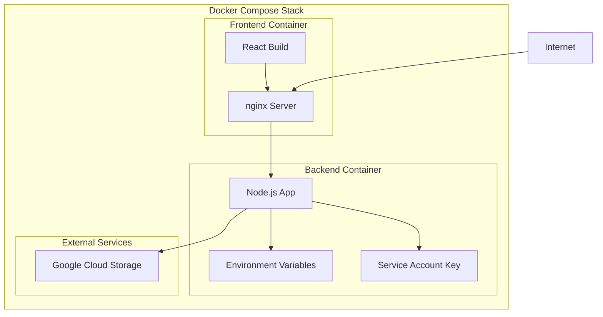

# Deployment Guide

Production deployment guide for the CloudStorage application.

## Deployment Overview

The CloudStorage application is designed for containerized deployment using Docker and can be deployed on various platforms:

- **Development**: Docker Compose (local)
- **Production**: Docker containers on cloud platforms
- **Supported Platforms**: AWS ECS, Google Cloud Run, Azure Container Instances, DigitalOcean App Platform

## Docker Architecture



## Production Deployment

### 1. Pre-Deployment Checklist

**Google Cloud Setup:**
- [ ] GCP project created
- [ ] Storage bucket created with proper permissions
- [ ] Service account with Storage Object Admin role
- [ ] Service account key file downloaded

**Security:**
- [ ] Environment variables configured (no hardcoded secrets)
- [ ] Service account key secured (not in version control)
- [ ] CORS configured for production domain
- [ ] HTTPS certificate ready

**Infrastructure:**
- [ ] Domain name configured
- [ ] SSL/TLS certificate obtained
- [ ] Load balancer configured (if using multiple instances)
- [ ] Monitoring and logging setup

### 2. Environment Configuration

**Production Environment Variables:**

# backend/.env.production
GCP_PROJECT=your-production-project-id
GCP_BUCKET=your-production-bucket
GCP_KEYFILE=/app/keyfile.json
PUBLIC_URL=https://api.yourdomain.com
PORT=3001
NODE_ENV=production


**Frontend Environment:**

# .env.production  
VITE_API_URL=https://api.yourdomain.com


### 3. Docker Production Configuration

**Production docker-compose.yml:**

version: '3.8'
services:
  backend:
    build: 
      context: ./backend
      dockerfile: Dockerfile.prod
    container_name: cloudstorage-backend-prod
    environment:
      - NODE_ENV=production
    env_file:
      - ./backend/.env.production
    ports:
      - "3001:3001"
    restart: unless-stopped
    healthcheck:
      test: ["CMD", "curl", "-f", "http://localhost:3001/files"]
      interval: 30s
      timeout: 10s
      retries: 3
    networks:
      - app-network

  frontend:
    build:
      context: .
      dockerfile: Dockerfile.prod
      args:
        - VITE_API_URL=https://api.yourdomain.com
    container_name: cloudstorage-frontend-prod
    ports:
      - "80:80"
      - "443:443"
    volumes:
      - ./ssl:/etc/nginx/ssl:ro
    depends_on:
      backend:
        condition: service_healthy
    restart: unless-stopped
    networks:
      - app-network

networks:
  app-network:
    driver: bridge


**Production Dockerfile.prod (Backend):**
```dockerfile
FROM node:18-alpine

WORKDIR /app

# Install dependencies
COPY package*.json ./
RUN npm ci --only=production

# Copy source code
COPY . .

# Create non-root user
RUN addgroup -g 1001 -S nodejs
RUN adduser -S backend -u 1001
USER backend

# Health check
HEALTHCHECK --interval=30s --timeout=3s --start-period=5s --retries=3 \
  CMD curl -f http://localhost:3001/files || exit 1

EXPOSE 3001

CMD ["node", "index.js"]
```

**Production Dockerfile.prod (Frontend):**
```dockerfile
# Build stage
FROM node:18-alpine as builder

WORKDIR /app
COPY package*.json ./
RUN npm ci

COPY . .
ARG VITE_API_URL
ENV VITE_API_URL=$VITE_API_URL

RUN npm run build

# Production stage
FROM nginx:alpine

# Copy build files
COPY --from=builder /app/dist /usr/share/nginx/html

# Copy nginx configuration
COPY nginx.prod.conf /etc/nginx/nginx.conf

# Create nginx user
RUN adduser -D -s /bin/sh nginx || true

EXPOSE 80 443

CMD ["nginx", "-g", "daemon off;"]
```

### 4. nginx Production Configuration

**nginx.prod.conf:**
```nginx
user nginx;
worker_processes auto;
error_log /var/log/nginx/error.log;
pid /run/nginx.pid;

events {
    worker_connections 1024;
    use epoll;
    multi_accept on;
}

http {
    include /etc/nginx/mime.types;
    default_type application/octet-stream;

    # Logging
    log_format main '$remote_addr - $remote_user [$time_local] "$request" '
                   '$status $body_bytes_sent "$http_referer" '
                   '"$http_user_agent" "$http_x_forwarded_for"';
    access_log /var/log/nginx/access.log main;

    # Performance
    sendfile on;
    tcp_nopush on;
    tcp_nodelay on;
    keepalive_timeout 65;
    types_hash_max_size 2048;
    client_max_body_size 500M;

    # Gzip compression
    gzip on;
    gzip_vary on;
    gzip_min_length 10240;
    gzip_proxied expired no-cache no-store private must-revalidate auth;
    gzip_types
        text/plain
        text/css
        text/xml
        text/javascript
        application/javascript
        application/xml+rss
        application/json;

    # Security headers
    add_header X-Frame-Options DENY;
    add_header X-Content-Type-Options nosniff;
    add_header X-XSS-Protection "1; mode=block";
    add_header Strict-Transport-Security "max-age=63072000; includeSubDomains; preload";

    server {
        listen 80;
        server_name yourdomain.com www.yourdomain.com;
        
        # Redirect HTTP to HTTPS
        return 301 https://$server_name$request_uri;
    }

    server {
        listen 443 ssl http2;
        server_name yourdomain.com www.yourdomain.com;
        
        root /usr/share/nginx/html;
        index index.html;

        # SSL configuration
        ssl_certificate /etc/nginx/ssl/cert.pem;
        ssl_certificate_key /etc/nginx/ssl/key.pem;
        ssl_protocols TLSv1.2 TLSv1.3;
        ssl_ciphers ECDHE-RSA-AES256-GCM-SHA512:DHE-RSA-AES256-GCM-SHA512;
        ssl_prefer_server_ciphers off;
        ssl_session_cache shared:SSL:10m;
        ssl_session_timeout 10m;

        # Static files with caching
        location ~* \.(js|css|png|jpg|jpeg|gif|ico|svg|woff|woff2)$ {
            expires 1y;
            add_header Cache-Control "public, immutable";
        }

        # API proxy
        location /api/ {
            proxy_pass http://backend:3001/;
            proxy_set_header Host $host;
            proxy_set_header X-Real-IP $remote_addr;
            proxy_set_header X-Forwarded-For $proxy_add_x_forwarded_for;
            proxy_set_header X-Forwarded-Proto $scheme;
            proxy_read_timeout 300s;
            proxy_connect_timeout 75s;
        }

        # React routing
        location / {
            try_files $uri $uri/ /index.html;
        }

        # Health check
        location /health {
            access_log off;
            return 200 "healthy\n";
            add_header Content-Type text/plain;
        }
    }
}
```

## Cloud Platform Deployment

### Google Cloud Run

**1. Build and Push Container:**
```bash
# Build backend
gcloud builds submit ./backend --tag gcr.io/PROJECT-ID/cloudstorage-backend

# Build frontend
gcloud builds submit . --tag gcr.io/PROJECT-ID/cloudstorage-frontend
```

**2. Deploy Services:**
```bash
# Deploy backend
gcloud run deploy cloudstorage-backend \
  --image gcr.io/PROJECT-ID/cloudstorage-backend \
  --platform managed \
  --region us-central1 \
  --allow-unauthenticated \
  --memory 512Mi \
  --cpu 1 \
  --max-instances 10

# Deploy frontend
gcloud run deploy cloudstorage-frontend \
  --image gcr.io/PROJECT-ID/cloudstorage-frontend \
  --platform managed \
  --region us-central1 \
  --allow-unauthenticated \
  --memory 256Mi \
  --cpu 0.5
```

### AWS ECS

**task-definition.json:**
```json
{
  "family": "cloudstorage",
  "networkMode": "awsvpc",
  "requiresCompatibilities": ["FARGATE"],
  "cpu": "512",
  "memory": "1024",
  "executionRoleArn": "arn:aws:iam::ACCOUNT:role/ecsTaskExecutionRole",
  "containerDefinitions": [
    {
      "name": "backend",
      "image": "your-ecr-repo/cloudstorage-backend:latest",
      "memory": 512,
      "essential": true,
      "portMappings": [
        {
          "containerPort": 3001,
          "protocol": "tcp"
        }
      ],
      "environment": [
        {"name": "NODE_ENV", "value": "production"}
      ],
      "secrets": [
        {"name": "GCP_PROJECT", "valueFrom": "arn:aws:secretsmanager:..."},
        {"name": "GCP_BUCKET", "valueFrom": "arn:aws:secretsmanager:..."}
      ],
      "logConfiguration": {
        "logDriver": "awslogs",
        "options": {
          "awslogs-group": "/ecs/cloudstorage",
          "awslogs-region": "us-east-1",
          "awslogs-stream-prefix": "ecs"
        }
      }
    }
  ]
}
```

### DigitalOcean App Platform

**app.yaml:**
```yaml
name: cloudstorage
services:
- name: backend
  source_dir: backend
  github:
    repo: your-username/dreamy-file-garden
    branch: main
  run_command: node index.js
  environment_slug: node-js
  instance_count: 1
  instance_size_slug: basic-xxs
  envs:
  - key: NODE_ENV
    value: production
  - key: GCP_PROJECT
    value: your-project-id
    type: SECRET
  - key: GCP_BUCKET  
    value: your-bucket-name
    type: SECRET

- name: frontend
  source_dir: /
  github:
    repo: your-username/dreamy-file-garden
    branch: main
  build_command: npm run build
  run_command: npx serve -s dist -l 3000
  environment_slug: node-js
  instance_count: 1
  instance_size_slug: basic-xxs
  envs:
  - key: VITE_API_URL
    value: https://backend-service-url.ondigitalocean.app
```

## Security Hardening

### 1. Container Security
```dockerfile
# Use non-root user
RUN addgroup -g 1001 -S nodejs
RUN adduser -S backend -u 1001
USER backend

# Remove package managers
RUN apk del apk-tools

# Set read-only root filesystem
# Add to docker-compose.yml:
# read_only: true
# tmpfs:
#   - /tmp
```

### 2. Environment Security
```bash
# Encrypt environment variables
# Use Docker secrets or cloud secret managers

# Example with Docker Swarm
echo "your-gcp-project" | docker secret create gcp_project -
```

### 3. Network Security
```yaml
# docker-compose.yml
networks:
  app-network:
    driver: bridge
    internal: true  # No external access except through nginx
```

## Monitoring and Logging

### 1. Application Monitoring

**Health Checks:**
```javascript
// Add to backend/index.js
app.get('/health', (req, res) => {
  res.json({
    status: 'healthy',
    timestamp: new Date().toISOString(),
    uptime: process.uptime()
  });
});
```

**Metrics Collection:**
```javascript
// Add basic metrics
let requestCount = 0;
app.use((req, res, next) => {
  requestCount++;
  next();
});

app.get('/metrics', (req, res) => {
  res.json({
    requests_total: requestCount,
    memory_usage: process.memoryUsage(),
    cpu_usage: process.cpuUsage()
  });
});
```

### 2. Log Management

**Structured Logging:**
```javascript
// Replace console.log with structured logging
const winston = require('winston');

const logger = winston.createLogger({
  level: 'info',
  format: winston.format.json(),
  transports: [
    new winston.transports.Console()
  ]
});

// Use in application
logger.info('File uploaded', { filename: file.name, size: file.size });
```

## Scaling Considerations

### Horizontal Scaling
```yaml
# docker-compose.yml
services:
  backend:
    deploy:
      replicas: 3
    # Add load balancer
```

### Performance Optimization
- Enable gzip compression
- Use CDN for static assets
- Implement caching headers
- Add database for metadata (if needed)
- Use connection pooling

## Backup and Recovery

### Database Backup
```bash
# If using database for metadata
# Schedule regular backups
0 2 * * * pg_dump -h localhost -U user -d cloudstorage > backup.sql
```

### GCS Backup Strategy
- Enable versioning on GCS bucket
- Set up lifecycle policies for old versions
- Cross-region replication for critical data

## Troubleshooting

### Common Deployment Issues

**1. Container Won't Start**
```bash
# Check logs
docker logs container-name

# Check resource limits
docker stats container-name
```

**2. Service Discovery Issues**
```bash
# Verify network connectivity
docker exec container-name ping other-service
```

**3. Permission Issues**
```bash
# Check service account permissions
gcloud projects get-iam-policy PROJECT-ID
```

**4. SSL Certificate Issues**
```bash
# Test certificate
openssl x509 -in cert.pem -text -noout

# Verify SSL setup
curl -vI https://yourdomain.com
```