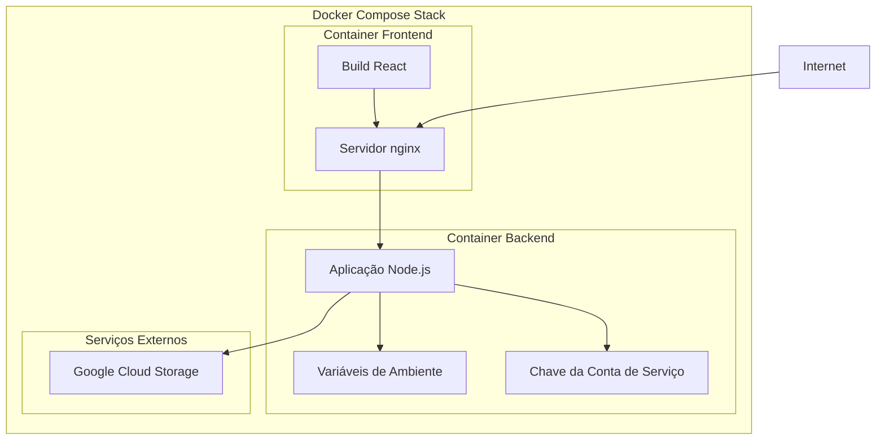

# Guia de Deploy

Guia de deploy em produção para a aplicação CloudStorage.

## Visão Geral do Deploy

A aplicação CloudStorage foi projetada para deploy containerizado usando Docker e pode ser implantada em várias plataformas:

- **Desenvolvimento**: Docker Compose (local)
- **Produção**: Containers Docker em plataformas de nuvem
- **Plataformas Suportadas**: AWS ECS, Google Cloud Run, Azure Container Instances, DigitalOcean App Platform

## Arquitetura Docker



## Deploy em Produção

### 1. Checklist Pré-Deploy

**Configuração Google Cloud:**
- [ ] Projeto GCP criado
- [ ] Bucket de armazenamento criado com permissões adequadas
- [ ] Conta de serviço com role Storage Object Admin
- [ ] Arquivo de chave da conta de serviço baixado

**Segurança:**
- [ ] Variáveis de ambiente configuradas (sem secrets hardcoded)
- [ ] Chave da conta de serviço protegida (não no controle de versão)
- [ ] CORS configurado para domínio de produção
- [ ] Certificado HTTPS pronto

**Infraestrutura:**
- [ ] Nome de domínio configurado
- [ ] Certificado SSL/TLS obtido
- [ ] Load balancer configurado (se usando múltiplas instâncias)
- [ ] Monitoramento e logging configurados

### 2. Configuração do Ambiente

**Variáveis de Ambiente de Produção:**

# backend/.env.production
GCP_PROJECT=your-production-project-id
GCP_BUCKET=your-production-bucket
GCP_KEYFILE=/app/keyfile.json
PUBLIC_URL=https://api.yourdomain.com
PORT=3001
NODE_ENV=production


**Ambiente Frontend:**

# .env.production  
VITE_API_URL=https://api.yourdomain.com


### 3. Configuração Docker de Produção

**docker-compose.yml de produção:**

version: '3.8'
services:
  backend:
    build: 
      context: ./backend
      dockerfile: Dockerfile.prod
    container_name: cloudstorage-backend-prod
    environment:
      - NODE_ENV=production
    env_file:
      - ./backend/.env.production
    ports:
      - "3001:3001"
    restart: unless-stopped
    healthcheck:
      test: ["CMD", "curl", "-f", "http://localhost:3001/files"]
      interval: 30s
      timeout: 10s
      retries: 3
    networks:
      - app-network

  frontend:
    build:
      context: .
      dockerfile: Dockerfile.prod
      args:
        - VITE_API_URL=https://api.yourdomain.com
    container_name: cloudstorage-frontend-prod
    ports:
      - "80:80"
      - "443:443"
    volumes:
      - ./ssl:/etc/nginx/ssl:ro
    depends_on:
      backend:
        condition: service_healthy
    restart: unless-stopped
    networks:
      - app-network

networks:
  app-network:
    driver: bridge


**Dockerfile.prod de produção (Backend):**
```dockerfile
FROM node:18-alpine

WORKDIR /app

# Instalar dependências
COPY package*.json ./
RUN npm ci --only=production

# Copiar código fonte
COPY . .

# Criar usuário não-root
RUN addgroup -g 1001 -S nodejs
RUN adduser -S backend -u 1001
USER backend

# Health check
HEALTHCHECK --interval=30s --timeout=3s --start-period=5s --retries=3 \
  CMD curl -f http://localhost:3001/files || exit 1

EXPOSE 3001

CMD ["node", "index.js"]
```

**Dockerfile.prod de produção (Frontend):**
```dockerfile
# Estágio de build
FROM node:18-alpine as builder

WORKDIR /app
COPY package*.json ./
RUN npm ci

COPY . .
ARG VITE_API_URL
ENV VITE_API_URL=$VITE_API_URL

RUN npm run build

# Estágio de produção
FROM nginx:alpine

# Copiar arquivos de build
COPY --from=builder /app/dist /usr/share/nginx/html

# Copiar configuração nginx
COPY nginx.prod.conf /etc/nginx/nginx.conf

# Criar usuário nginx
RUN adduser -D -s /bin/sh nginx || true

EXPOSE 80 443

CMD ["nginx", "-g", "daemon off;"]
```

### 4. Configuração nginx de Produção

**nginx.prod.conf:**
```nginx
user nginx;
worker_processes auto;
error_log /var/log/nginx/error.log;
pid /run/nginx.pid;

events {
    worker_connections 1024;
    use epoll;
    multi_accept on;
}

http {
    include /etc/nginx/mime.types;
    default_type application/octet-stream;

    # Logging
    log_format main '$remote_addr - $remote_user [$time_local] "$request" '
                   '$status $body_bytes_sent "$http_referer" '
                   '"$http_user_agent" "$http_x_forwarded_for"';
    access_log /var/log/nginx/access.log main;

    # Performance
    sendfile on;
    tcp_nopush on;
    tcp_nodelay on;
    keepalive_timeout 65;
    types_hash_max_size 2048;
    client_max_body_size 500M;

    # Compressão Gzip
    gzip on;
    gzip_vary on;
    gzip_min_length 10240;
    gzip_proxied expired no-cache no-store private must-revalidate auth;
    gzip_types
        text/plain
        text/css
        text/xml
        text/javascript
        application/javascript
        application/xml+rss
        application/json;

    # Headers de segurança
    add_header X-Frame-Options DENY;
    add_header X-Content-Type-Options nosniff;
    add_header X-XSS-Protection "1; mode=block";
    add_header Strict-Transport-Security "max-age=63072000; includeSubDomains; preload";

    server {
        listen 80;
        server_name yourdomain.com www.yourdomain.com;
        
        # Redirecionar HTTP para HTTPS
        return 301 https://$server_name$request_uri;
    }

    server {
        listen 443 ssl http2;
        server_name yourdomain.com www.yourdomain.com;
        
        root /usr/share/nginx/html;
        index index.html;

        # Configuração SSL
        ssl_certificate /etc/nginx/ssl/cert.pem;
        ssl_certificate_key /etc/nginx/ssl/key.pem;
        ssl_protocols TLSv1.2 TLSv1.3;
        ssl_ciphers ECDHE-RSA-AES256-GCM-SHA512:DHE-RSA-AES256-GCM-SHA512;
        ssl_prefer_server_ciphers off;
        ssl_session_cache shared:SSL:10m;
        ssl_session_timeout 10m;

        # Arquivos estáticos com cache
        location ~* \.(js|css|png|jpg|jpeg|gif|ico|svg|woff|woff2)$ {
            expires 1y;
            add_header Cache-Control "public, immutable";
        }

        # Proxy da API
        location /api/ {
            proxy_pass http://backend:3001/;
            proxy_set_header Host $host;
            proxy_set_header X-Real-IP $remote_addr;
            proxy_set_header X-Forwarded-For $proxy_add_x_forwarded_for;
            proxy_set_header X-Forwarded-Proto $scheme;
            proxy_read_timeout 300s;
            proxy_connect_timeout 75s;
        }

        # Roteamento React
        location / {
            try_files $uri $uri/ /index.html;
        }

        # Health check
        location /health {
            access_log off;
            return 200 "healthy\n";
            add_header Content-Type text/plain;
        }
    }
}
```

## Deploy em Plataformas de Nuvem

### Google Cloud Run

**1. Build e Push do Container:**
```bash
# Build backend
gcloud builds submit ./backend --tag gcr.io/PROJECT-ID/cloudstorage-backend

# Build frontend
gcloud builds submit . --tag gcr.io/PROJECT-ID/cloudstorage-frontend
```

**2. Deploy dos Serviços:**
```bash
# Deploy backend
gcloud run deploy cloudstorage-backend \
  --image gcr.io/PROJECT-ID/cloudstorage-backend \
  --platform managed \
  --region us-central1 \
  --allow-unauthenticated \
  --memory 512Mi \
  --cpu 1 \
  --max-instances 10

# Deploy frontend
gcloud run deploy cloudstorage-frontend \
  --image gcr.io/PROJECT-ID/cloudstorage-frontend \
  --platform managed \
  --region us-central1 \
  --allow-unauthenticated \
  --memory 256Mi \
  --cpu 0.5
```

### AWS ECS

**task-definition.json:**
```json
{
  "family": "cloudstorage",
  "networkMode": "awsvpc",
  "requiresCompatibilities": ["FARGATE"],
  "cpu": "512",
  "memory": "1024",
  "executionRoleArn": "arn:aws:iam::ACCOUNT:role/ecsTaskExecutionRole",
  "containerDefinitions": [
    {
      "name": "backend",
      "image": "your-ecr-repo/cloudstorage-backend:latest",
      "memory": 512,
      "essential": true,
      "portMappings": [
        {
          "containerPort": 3001,
          "protocol": "tcp"
        }
      ],
      "environment": [
        {"name": "NODE_ENV", "value": "production"}
      ],
      "secrets": [
        {"name": "GCP_PROJECT", "valueFrom": "arn:aws:secretsmanager:..."},
        {"name": "GCP_BUCKET", "valueFrom": "arn:aws:secretsmanager:..."}
      ],
      "logConfiguration": {
        "logDriver": "awslogs",
        "options": {
          "awslogs-group": "/ecs/cloudstorage",
          "awslogs-region": "us-east-1",
          "awslogs-stream-prefix": "ecs"
        }
      }
    }
  ]
}
```

### DigitalOcean App Platform

**app.yaml:**
```yaml
name: cloudstorage
services:
- name: backend
  source_dir: backend
  github:
    repo: your-username/dreamy-file-garden
    branch: main
  run_command: node index.js
  environment_slug: node-js
  instance_count: 1
  instance_size_slug: basic-xxs
  envs:
  - key: NODE_ENV
    value: production
  - key: GCP_PROJECT
    value: your-project-id
    type: SECRET
  - key: GCP_BUCKET  
    value: your-bucket-name
    type: SECRET

- name: frontend
  source_dir: /
  github:
    repo: your-username/dreamy-file-garden
    branch: main
  build_command: npm run build
  run_command: npx serve -s dist -l 3000
  environment_slug: node-js
  instance_count: 1
  instance_size_slug: basic-xxs
  envs:
  - key: VITE_API_URL
    value: https://backend-service-url.ondigitalocean.app
```

## Hardening de Segurança

### 1. Segurança de Container
```dockerfile
# Usar usuário não-root
RUN addgroup -g 1001 -S nodejs
RUN adduser -S backend -u 1001
USER backend

# Remover gerenciadores de pacotes
RUN apk del apk-tools

# Configurar sistema de arquivos raiz somente leitura
# Adicionar ao docker-compose.yml:
# read_only: true
# tmpfs:
#   - /tmp
```

### 2. Segurança do Ambiente
```bash
# Criptografar variáveis de ambiente
# Usar Docker secrets ou gerenciadores de secrets da nuvem

# Exemplo com Docker Swarm
echo "your-gcp-project" | docker secret create gcp_project -
```

### 3. Segurança de Rede
```yaml
# docker-compose.yml
networks:
  app-network:
    driver: bridge
    internal: true  # Sem acesso externo exceto através do nginx
```

## Monitoramento e Logging

### 1. Monitoramento da Aplicação

**Health Checks:**
```javascript
// Adicionar ao backend/index.js
app.get('/health', (req, res) => {
  res.json({
    status: 'healthy',
    timestamp: new Date().toISOString(),
    uptime: process.uptime()
  });
});
```

**Coleta de Métricas:**
```javascript
// Adicionar métricas básicas
let requestCount = 0;
app.use((req, res, next) => {
  requestCount++;
  next();
});

app.get('/metrics', (req, res) => {
  res.json({
    requests_total: requestCount,
    memory_usage: process.memoryUsage(),
    cpu_usage: process.cpuUsage()
  });
});
```

### 2. Gerenciamento de Logs

**Logging Estruturado:**
```javascript
// Substituir console.log por logging estruturado
const winston = require('winston');

const logger = winston.createLogger({
  level: 'info',
  format: winston.format.json(),
  transports: [
    new winston.transports.Console()
  ]
});

// Usar na aplicação
logger.info('File uploaded', { filename: file.name, size: file.size });
```

## Considerações de Escalabilidade

### Escalabilidade Horizontal
```yaml
# docker-compose.yml
services:
  backend:
    deploy:
      replicas: 3
    # Adicionar load balancer
```

### Otimização de Performance
- Habilitar compressão gzip
- Usar CDN para assets estáticos
- Implementar headers de cache
- Adicionar banco de dados para metadados (se necessário)
- Usar connection pooling

## Backup e Recuperação

### Backup do Banco de Dados
```bash
# Se usando banco de dados para metadados
# Agendar backups regulares
0 2 * * * pg_dump -h localhost -U user -d cloudstorage > backup.sql
```

### Estratégia de Backup GCS
- Habilitar versionamento no bucket GCS
- Configurar políticas de lifecycle para versões antigas
- Replicação cross-region para dados críticos

## Solução de Problemas

### Problemas Comuns de Deploy

**1. Container Não Inicia**
```bash
# Verificar logs
docker logs container-name

# Verificar limites de recursos
docker stats container-name
```

**2. Problemas de Service Discovery**
```bash
# Verificar conectividade de rede
docker exec container-name ping other-service
```

**3. Problemas de Permissão**
```bash
# Verificar permissões da conta de serviço
gcloud projects get-iam-policy PROJECT-ID
```

**4. Problemas de Certificado SSL**
```bash
# Testar certificado
openssl x509 -in cert.pem -text -noout

# Verificar configuração SSL
curl -vI https://yourdomain.com
```